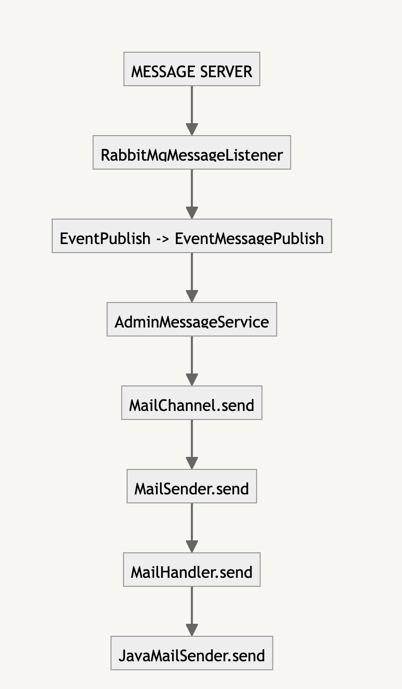
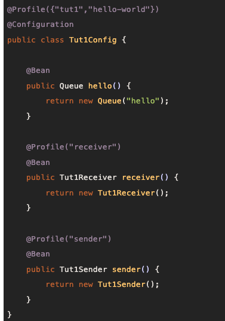
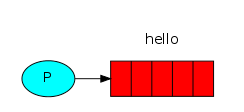
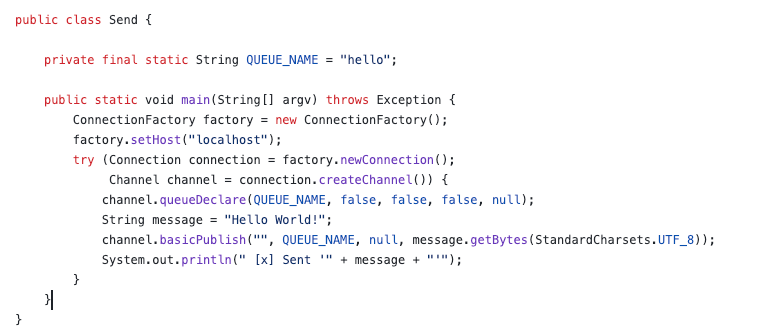
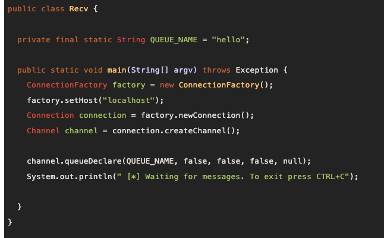

# 11.27 ~ 12.01

# publish 세이브로직후 이메일 발송로직 설계

- 기존 개발 방식은 개발부터했는데 이번에는 코드의 흐름을 보면서 설계부터 시작

- 메일 기능을 추가 했을시 예상되는 흐름도
- 대략적인 흐름은 다른 메일보내는 로직과 비슷

## 미정

- 어떤 데이터를 메일로 보낼 것인가?
- 메일 템플릿을 사용? 아님 평문을 메일로 보낼 것  인가.
- Action시 제목은? RequestDemoSave?

1. EventPublish 기존 `EventMessagePublish가 있어서 사용할 것인가`
2. ApplicationEventPublish를 사용할 것인가? (의존성을 약화 시키기 위해)
3. publish.send ( EventMessagePublish.send(EventMeesage.build)) 객체를 사용해 `EventMessagePublish`로 전달
4. EventMeesage 들어갈 필드 값은 From(Admin) , Action(SaveRequestDemo) , payload(데이터 미정)
5. `RabbitTemplate을 이용해 convertSend`
6. 파라미터는 ExchangeName ,  MessageQueueName , Dto (여기선 EventMessage객체)

1. MessageServer 에 `RabbitMqMessageListener 리스너를 통해 메세지를 받는다`
2. Action Or from에 따라 분기를 나눈다 ( 여기선 from.Admin)
3. 분기에 따라 나뉜 서비스 안에서 로직수행
4. 전달된 데이터 (reqeustDemo save data) , 그리고 메일 템플릿 사용? 사용하면  템플레이트 레파지토리에서 메일 템플레이트를 가져온 후, 데이터 필드랑 매칭된 필드들을 replace한후
5. `mailResponse로 만들어서 mailChnnel을 통해 보낸다.`
6. mailChannel은 자바 mailsender를 통해 최종적으로 이메일을 보냄
7. 메일 발송 처리가 끝나고 나면 auditLog로 로그메세지를 전송한다.

- 코드를 보면서 대략적인 흐름도를 설명으로 적었다. 그런대 이 방식도 괜찮은거같다
- 이렇게 코드를 정리하니 너무 쓸모없는 코드도 있는게아닌가 뭔가 정리되는 느낌...
- 앞으로 설계? 라기 민망하지만 이런식으로 그려놓고 개발 하는 습관을 들여보자

# RabbitMq

- 간단하게 공식문서를 보면서 좀 정리를 해봐야 될거 같다.

## 간단 설명

1. 메시지 큐잉 (Message Queuing): RabbitMQ는 메시지를 임시로 저장하는 큐를 제공합니다. 이를 통해 메시지 발신자(Producer)는 메시지를 큐에 보내고, 수신자(Consumer)는 나중에 이 메시지를 처리할 수 있습니다. 이 과정은 비동기적으로 이루어집니다.

2. 분산 처리 (Distributed Processing): 여러 컨슈머가 동일한 큐에서 메시지를 수신하고 처리할 수 있습니다. 이를 통해 작업 부하를 여러 시스템이나 프로세스에 분산시키고, 처리 능력을 확장할 수 있습니다.

3. 비동기 통신 (Asynchronous Communication): RabbitMQ를 사용하면 시스템 간의 통신이 비동기적으로 이루어집니다. 즉, 메시지를 보내는 쪽은 메시지가 언제 처리될지 기다릴 필요 없이 다른 작업을 계속 진행할 수 있습니다.

4. 탄력적인 시스템 설계 (Resilient System Design): 메시지가 큐에 저장되기 때문에, 수신자(Consumer)가 일시적으로 사용 불가능한 상태일 때도 메시지가 손실되지 않습니다. 수신자가 다시 사용 가능해지면 메시지를 처리할 수 있습니다.

확장성 (Scalability): RabbitMQ는 수평적 확장이 용이합니다. 시스템의 부하가 증가하면, 추가 컨슈머를 도입하여 처리 능력을 증가시킬 수 있습니다.

## 우체국
- Producer(생산한다) :  메시지를 보내는 프로그램 exchange, publish / Consumer(소비한다) 메시지 수신을 기다린다. 처리 주체

1. RabbitMq: 우체국 , 수락, 저장 및 전달?
2. Exchange :  producer로부터 전달받은 메세지를 어떤 queue로 보낼지 결정하는 장소, 4가지 타입이 있음 ( 우편함으로 가는 길 ?)
3. Queue : 우편함 이름 -> consumer가 메세지를 consume하기 전까지 보관하는 장소
4. Binding: Exchange와 Queue의 관계, 보통 사용자가 특정 exchange가 특정 queue를 binding하도록 정의한다. (fanout 타입은 예외)

    public class Tut1Sender {
    
        @Autowired
        private RabbitTemplate template;
    
        @Autowired
        private Queue queue;
    
        @Scheduled(fixedDelay = 1000, initialDelay = 500)
        public void send() {
            String message = "Hello World!";
            this.template.convertAndSend(queue.getName(), message);
            System.out.println(" [x] Sent '" + message + "'");
        }
    }

- sending code 
- 보낸 사람에게 자동 연결될 수 있는 RabbitTemplate 으로 래핑합니다. 이것은 메시지를 전송하는 데 사용됩니다.
- 방금 생성한 메시지의 대기열 이름을 전달하는 템플릿의 ConvertAndSend 메서드를 호출

    import org.springframework.amqp.rabbit.annotation.RabbitHandler;
    import org.springframework.amqp.rabbit.annotation.RabbitListener;
    
    @RabbitListener(queues = "hello")
    public class Tut1Receiver {
    
        @RabbitHandler
        public void receive(String in) {
            System.out.println(" [x] Received '" + in + "'");
        }
    }

- Receiving
- 수신자 클래스에 주석을 달고 대기열 이름을 전달
- 주석을 사용한 선언적방식 더 효율적이고 좋은거 같다
- 

- 대략적인 연결 코드
- 연결은 소켓 연결을 추상화하고 프로토콜 버전 협상 및 인증 등을 처리합니다. 여기서는 로컬 머신의 RabbitMQ 노드, 즉 localhost에 연결
- 연결 추상? 버전 인증 처리? 아무튼 저 설정에는 레빗 엠큐에 연결하는 코드가 설정 된다.
-  Connection 과 Channel 모두 java.lang.AutoCloseable을 구현

- 공식홈페이지의 예제 소스
1.  클래스 및 큐 설정: Send 클래스는 RabbitMQ를 사용하여 메시지를 전송하는 기능을 담당합니다. 이 예제에서는 "hello"라는 이름의 큐를 사용합니다.

2. RabbitMQ 서버 연결 설정: ConnectionFactory를 사용하여 RabbitMQ 서버에 연결합니다. 여기서는 로컬 호스트("localhost")에 있는 서버에 연결하도록 설정합니다.

3. 연결 및 채널 생성: factory.newConnection()을 호출하여 서버에 연결하고, connection.createChannel()을 
    통해 메시지 전송에 사용할 채널을 생성합니다. try-with-resources 구문을 사용하여 자동으로 리소스를 관리합니다.

4. 큐 선언 및 메시지 전송: channel.queueDeclare를 호출하여 지정된 이름의 큐가 없으면 새로 생성합니다. channel.basicPublish를 사용하여 "Hello World!" 메시지를 해당 큐에 전송합니다.

## 문의글 save후 메일전송 개발

- 위에 레빗엠큐를 잠시보면서 메세지서버를보니 리펙토링을 해야겠다는 생각을했따
- 그런데 문제는 레빗엠큐는 큐를 하나만 사용하는게 좋을꺼 아니면 어느정도까지 갯수를 사용하는게 좋을까
- 명확한 기준이 나와있지않고 프로젝트 상황에 따라 다르다는데 체감이 잘안돼서 많이힘들었다.
- 현재 메세지 서버를 리펙토링하기엔 설계 준비된게없어서 잠시 미루고.
- 어플리케이션 이벤트를 발생시켜 일단 메세지서버에 메일 전달되는 부분에 규격에 맞춰 데이터를 보내주고 메시지 전송 시스템을 완성햇다.
